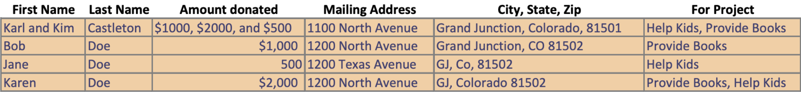

# Normalized Data Design Ideas for the Following Dataset  :

>Without succinct clarification from the original author of the given dataset, there are a few pieces
>of data that, to be able to better format, may require some potentially presumptuous solutions.

Donater ID# | First Name | Last Name | Street Address | State and Zip |

Donation ID # | Amount Donated | Help Kids | Provide Books |
  

        
